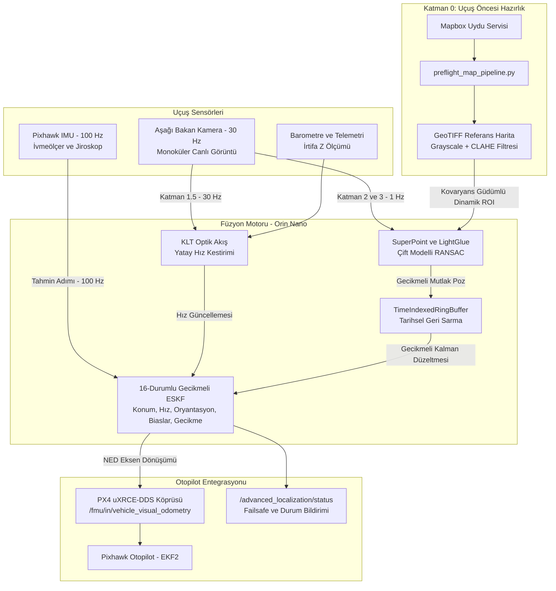

# 🛰️ GPS-Denied Visual-Inertial Navigation & Localization Stack

[](https://www.python.org/)
[](https://isocpp.org/)
[](https://docs.ros.org/en/humble/)
[](https://docs.px4.io/)
[](https://github.com/cvg/LightGlue)
[](#)

İnsansız Hava Araçları (İHA) için **GPS karartması (jamming)**, **aldatması (spoofing)** veya **sinyal yokluğunda** yüksek hassasiyetli, gerçek zamanlı seyrüsefer ve mutlak konumlandırma sağlayan **hiyerarşik görsel-eylemsel (Visual-Inertial Odometry / Absolute Georeferenced Localization)** seyrüsefer sistemi.

Sistem, hem **Python** (algoritma doğrulama, simülasyon, video/telemetri testleri) hem de **C++ / ROS 2** (NVIDIA Jetson Orin Nano ve Pixhawk / PX4 donanımında düşük gecikmeli uçuş) mimarisiyle tam uyumlu olarak geliştirilmiştir.

---

## 📌 İçindekiler
- [Proje Genel Bakış](#-proje-genel-bakış)
- [Sistem Mimarisi ve Katmanlar](#-sistem-mimarisi-ve-katmanlar)
- [Temel Özellikler](#-temel-özellikler)
- [Dizin Yapısı](#-dizin-yapısı)
- [Kurulum](#-kurulum)
  - [1. Python Ortamı](#1-python-ortamı)
  - [2. C++ & ROS 2 Ortamı (Jetson Orin / Linux)](#2-c--ros-2-ortamı-jetson-orin--linux)
- [Kullanım ve Test Adımları](#-kullanım-ve-test-adımları)
  - [Adım 1: Uçuş Öncesi Referans Harita Üretimi](#adım-1-uçuş-öncesi-referans-harita-üretimi-katman-0)
  - [Adım 2: Sentetik Uçuş Simülasyonu](#adım-2-sentetik-uçuş-simülasyonu)
  - [Adım 3: Video ve Telemetri (SRT) ile Test & Görselleştirme](#adım-3-video-ve-telemetri-srt-ile-test--görselleştirme)
  - [Adım 4: C++ Yüksek Performanslı Runner (WSL / Orin)](#adım-4-c-yüksek-performanslı-runner-wsl--orin)
  - [Adım 5: Gerçek Donanımda Uçuş (ROS 2 + PX4 uXRCE-DDS)](#adım-5-gerçek-donanımda-uçuş-ros-2--px4-uxrce-dds)
- [Koordinat Sistemleri ve Sensör Füzyonu](#-koordinat-sistemleri-ve-sensör-füzyonu)
- [Failsafe ve Güvenlik Modları](#-failsafe-ve-güvenlik-modları)
- [Katkıda Bulunma ve Lisans](#-katkıda-bulunma-ve-lisans)

---

## 🎯 Proje Genel Bakış ve Çözülen Problemler

Geleneksel otopilotlar GPS kesildiğinde yalnızca dahili IMU (ivmeölçer ve jiroskop) verilerini çift entegre ederek ölü kestirim (Dead Reckoning) yapar. Sensörlerdeki beyaz gürültü ve bias kaymaları, tahmin hatasının kuadratik/kübik büyümesine ve uçağın saniyeler içinde rotadan sapıp düşmesine yol açar.

Bu projede geliştirilen sistem, GPS'in olmadığı ortamlarda aşağıdaki 5 kritik mühendislik problemini katmanlı yaklaşımla çözer:

| Karşılaşılan Problem | Neden Oluşur? | Uygulanan Mühendislik Çözümü |
| :--- | :--- | :--- |
| **1. IMU Sapması (Drift)** | Sensör gürültüleri ve bias kayması hatayı katlayarak büyütür. | **İki Kademeli Düzeltme:** 30 Hz KLT Optik Akış ile yatay hız (velocity) kilitlenir; 1 Hz mutlak harita eşleme ile birikimli konum hatası sıfırlanır. |
| **2. Yapay Zeka Gecikmesi (100–300 ms)** | SuperPoint + LightGlue modellerinin GPU çıkarım süresi gecikmeye sebep olur. Uçak bu sürede metrelerce yol alır. | **Halka Tampon (Ring Buffer) ve Tarihsel Replay:** Ölçüm geldiğinde $t_d$ kadar geriye gidilir, Kalman düzeltmesi o ana uygulanır ve ara IMU verileriyle filtre günümüz anına hızla tekrar ileri sarılır. |
| **3. Hatalı Eşleşmeler (Outliers)** | Benzer bina çatıları, tarla dokuları veya perspektif farkları yanlış nokta eşleştirebilir. | **Çok Kriterli Geometrik Doğrulama:** Çift Modelli RANSAC (Düz arazi için Homografi, engebeli arazi için Temel Matris), İrtifa-Ölçek tutarlılık kontrolü ve Mahalanobis mesafe kapılama ($d_M \le 9.21$). |
| **4. Mevsim ve Işık Değişimi (Domain Shift)** | Uydu haritası ile dron kamerası arasında güneş açısı, kar/yeşillik veya gölge farkları bulunur. | **SuperPoint + LightGlue + Dinamik ROI:** Derin öğrenme tabanlı bağlamsal eşleme, CLAHE kontrast dengelemesi ve uçağın $3\sigma$ kovaryansına göre haritadan dinamik pencere kesme. |
| **5. Eksen ve Protokol Uyuşmazlığı** | Otopilot (PX4) havacılık standardı (NED/FRD) kullanırken, navigasyon algoritmaları robotik standardı (ENU/FLU) kullanır. | **İzole Koordinat Adaptörü & uXRCE-DDS:** MAVROS aracı katmanını kaldırıp mikrosaniye seviyesinde yerel PX4 DDS köprüsü ve güvenli eksen dönüşümü. |

---

## 🏗 Sistem Mimarisi ve Katmanlar

Aşağıdaki mimari şema, uçuş öncesi hazırlıktan otopilot motor kontrolüne kadar veri akışını özetlemektedir:



### Katman Detayları ve Algoritmik Çözüm Adımları

#### 🔹 Katman 0: Coğrafi Referans Haritası Üretimi (Pre-Flight Pipeline)
* **Adım:** Uçuş yapılacak koordinatların merkez enlem/boylamı, yarıçapı ve piksel başına zemin çözünürlüğü (GSD) belirlenir.
* **İşlem:** Mapbox API üzerinden yüksek çözünürlüklü uydu karoları (tiles) indirilir, mozaiklenir ve GeoTIFF formatına dönüştürülür.
* **İyileştirme:** Farklı güneş açıları ve aydınlatma farklarına karşı **CLAHE (Contrast Limited Adaptive Histogram Equalization)** uygulanarak haritanın yerel kontrastı normalize edilir.

#### 🔹 Katman 1: 16-Durumlu Hata Durumlu Kalman Filtresi (ESKF - 100 Hz)
* **Adım:** Pixhawk'tan gelen 100 Hz IMU ölçümleri integrasyon denklemine sokulur.
* **Durum Vektörü:** $\mathbf{x} = [\mathbf{p}_{3\times 1}, \mathbf{v}_{3\times 1}, \mathbf{q}_{4\times 1}, \mathbf{b}_a_{3\times 1}, \mathbf{b}_g_{3\times 1}, t_d]_{16\times 1}$
* **Özellik:** Standart EKF yerine açılardaki singülerlikleri (gimbal lock) engelleyen ve kuaterniyon kinematiğinde hata durumunu lineere yakın tutan **Hata Durumu (Error-State)** formülasyonu kullanılır.

#### 🔹 Katman 1.5: Bağıl Hız Gözlemcisi (KLT Optik Akış - 30 Hz)
* **Adım:** Yere bakan monoküler kameradan gelen ardışık iki kare arasında Lucas-Kanade (KLT) algoritmasıyla belirgin pikseller takip edilir.
* **İşlem:** Piksel kayması ($\Delta u, \Delta v$) ve barometrik irtifa ($h$) kullanılarak uçağın yerdeki anlık yatay hızı ($\hat{v}_x, \hat{v}_y$) hesaplanır.
* **Çözüm:** Harita eşleşmesi beklenirken (1 sn boyunca) İHA'nın IMU kaymasını sıfıra yakın tutar.

#### 🔹 Katman 2 & 3: Mutlak Coğrafi Eşleme (SuperPoint + LightGlue - 1 Hz)
* **Adım 1 (Dinamik ROI):** Tüm uydu haritasını taramak yüksek gecikmeye neden olur. Filtrenin mevcut konum kovaryansı ($3\sigma$) ve uçuş hızı kadar haritadan dinamik bir alt bölge (ROI) kesilir.
* **Adım 2 (Öznitelik Çıkarımı):** Canlı kamera karesi ile kesilen harita parçası **SuperPoint** evrişimli sinir ağına sokularak anahtar noktalar ve tanımlayıcılar (descriptors) çıkarılır.
* **Adım 3 (LightGlue Eşleme):** Transformer mimarili **LightGlue** ile noktalar eşleştirilir.
* **Adım 4 (Geometrik ve İstatistiksel Kapılama):**
  * Düz araziler için Homografi ($H$), engebeli araziler için Temel Matris ($F$) RANSAC modelleri yarıştırılır.
  * Uçağın irtifasıyla piksel ölçeği tutarlılığı doğrulanır.
  * Mahalanobis kapısı ($d_M \le 9.21$) ile ani sıçramalar elenir.
* **Adım 5 (Gecikmeli Güncelleme):** Çıkarım süresi $t_d$ kadar halka tamponda geçmişe dönülerek Kalman güncellemesi yapılır ve filtre güncel zamana kadar ileri simüle edilir.

---

## 🚀 Temel Özellikler

- **Tarihsel Gecikme Telafisi (Historical Replay):** Derin öğrenme eşleştirmesi 100-300 ms sürse dahi, zaman damgalı halka tampon sayesinde filtre geçmişe dönüp ölçümü uygular ve günümüze doğru hatasız ilerler.
- **Çift Dil Desteği:** Araştırma, hiperparametre optimizasyonu ve görselleştirme için Python; uçuş donanımı için sıfır-kopyalama (zero-copy) C++ ve Eigen mimarisi.
- **Modern PX4 Entegrasyonu:** MAVROS bağımlılığı olmadan, PX4 v1.14+ yerel standardı olan **Micro XRCE-DDS** üzerinden doğrudan `/fmu/in/vehicle_visual_odometry` beslemesi.
- **Gelişmiş Failsafe Mekanizması:** Görsel eşleşme kaybı, sensör tutarsızlığı ve kovaryans patlaması anında otomatik tespit ve durum bildirimi.
- **Zengin Test ve Kıyaslama (Benchmark):** DJI / GoPro MP4 videoları ve altyazı (SRT) telemetri dosyaları ile çevrimdışı (offline) birebir uçuş simülasyonu.

---

## 📁 Dizin Yapısı

```text
gps-denied-navigation/
├── advanced_localization_cpp/       # Yüksek performanslı C++ / ROS 2 paketi (Jetson Orin için)
│   ├── CMakeLists.txt              # Derleme kuralları ve bağımlılıklar (Eigen3, OpenCV, YAML)
│   ├── package.xml                 # ROS 2 paket manifestosu (px4_msgs, sensor_msgs vb.)
│   ├── include/                    # C++ başlık dosyaları (eskf, ring_buffer, optical_flow vb.)
│   ├── src/                        # C++ kaynak kodları ve ROS 2 düğümü (localization_node.cpp)
│   └── launch/                     # ROS 2 başlatma dosyaları (localization.launch.py)
├── config/                         # Sistem konfigürasyonları
│   ├── system_config.yaml          # Filtre kovaryansları, sensör hızları, gürültü modelleri
│   ├── system_config_video_lightglue.yaml # Video testleri için optimize LightGlue ayarları
│   └── camera_info_dummy.yaml      # Kamera iç parametreleri (intrinsics: fx, fy, cx, cy)
├── docs/                           # Teknik dökümantasyon ve donanım entegrasyon raporları
│   └── pixhawk_orin_cpp_migration_report.md # Pixhawk + Orin Nano uXRCE-DDS göç raporu
├── scripts/                        # Yardımcı araçlar ve test betikleri
│   ├── preflight_map_pipeline.py   # Mapbox API'den uydu haritası indirip GeoTIFF üreten araç
│   ├── run_video_testing.py        # Video (.mp4) ve telemetri (.srt) ile uçuş simülasyonu
│   ├── profile_lightglue_gpu.py    # LightGlue GPU çıkarım gecikmesi profilleyici
│   └── compress_jpg.py             # Harita ve görsel sıkıştırma aracı
├── simulation/                     # Simülasyon ortamı
│   └── synthetic_flight.py         # Yapay 3B yörünge ve IMU/kamera sentetik veri üreteci
├── src/advanced_localization/      # Çekirdek Python paketi
│   ├── eskf.py                     # 16-durumlu Hata Durumlu Kalman Filtresi motoru
│   ├── ring_buffer.py              # Zaman damgalı halka tampon (TimeIndexedRingBuffer)
│   ├── failsafe.py                 # Durum makinesi ve arıza tespit yöneticisi
│   ├── map_store.py                # GeoTIFF harita yönetimi ve dinamik ROI çıkarımı
│   ├── math_utils.py               # Kuaterniyon, rotasyon ve Lie cebiri matematiği
│   ├── types.py                    # Tip tanımlamaları (ImuSample, VisionMeasurement vb.)
│   ├── video_testing.py            # Video test işleme motoru
│   ├── ros2/                       # Python ROS 2 düğümü (navigation_node.py)
│   └── vision/                     # Bilgisayarlı görü katmanları
│       ├── superpoint_layer.py     # SuperPoint öznitelik çıkarımı
│       ├── lightglue_layer.py      # LightGlue derin öğrenme eşleyicisi & RANSAC
│       ├── optical_flow_layer.py   # OpenCV KLT optik akış hız kestirimi
│       └── roi_selector.py         # Dinamik harita arama penceresi seçici
├── tests/                          # Pytest birim ve entegrasyon testleri
├── requirements.txt                # Python bağımlılık listesi
└── pyproject.toml                  # Python proje metaverileri
```

---

## 🛠 Kurulum

### 1. Python Ortamı

Gereksinimler: Python 3.10+, PyTorch (CUDA destekli önerilir), OpenCV.

```bash
# 1. Depoyu klonlayın
git clone https://github.com/kadir465/Locating-without-GPS.git
cd Locating-without-GPS

# 2. Sanal ortam oluşturun ve aktif edin
python -m venv venv
# Windows:
.\venv\Scripts\activate
# Linux/macOS:
source venv/bin/activate

# 3. Bağımlılıkları yükleyin
pip install -r requirements.txt

# 4. Paketi geliştirici modunda kurun
pip install -e .
```

### 2. C++ & ROS 2 Ortamı (Jetson Orin / Linux)

Gereksinimler: Ubuntu 22.04, ROS 2 Humble, OpenCV 4.x, Eigen3, `px4_msgs`.

```bash
# 1. ROS 2 çalışma alanı oluşturun
mkdir -p ~/gps_denied_ws/src
cd ~/gps_denied_ws/src

# 2. Depoyu ve PX4 mesaj tanımlarını çekin
git clone https://github.com/kadir465/Locating-without-GPS.git
git clone https://github.com/PX4/px4_msgs.git

# 3. Derleyin
cd ~/gps_denied_ws
source /opt/ros/humble/setup.bash
colcon build --packages-select advanced_localization_cpp --cmake-args -DCMAKE_BUILD_TYPE=Release
```

---

## 🎮 Kullanım ve Test Adımları

### Adım 1: Uçuş Öncesi Referans Harita Üretimi (Katman 0)
Uçulacak bölgenin enlem, boylam ve yarıçapını girerek Mapbox üzerinden CLAHE uygulanmış GeoTIFF haritası oluşturun:

```bash
python scripts/preflight_map_pipeline.py \
  --mapbox-token "MAPBOX_TOKENINIZ" \
  --center-lat 41.0151 \
  --center-lon 28.9795 \
  --radius-m 2000 \
  --gsd 0.2 \
  --output deployment/map_preflight_clahe.tif
```

### Adım 2: Sentetik Uçuş Simülasyonu
Filtrenin matematiksel tutarlılığını yapay IMU ve kamera verileriyle test edin:

```bash
python -m simulation.synthetic_flight
# Birim testleri çalıştırmak için:
pytest
```

### Adım 3: Video ve Telemetri (SRT) ile Test & Görselleştirme
Daha önce kaydedilmiş bir İHA uçuş videosunu (.mp4) ve telemetri altyazısını (.srt) harita üzerinde canlı görselleştirerek test edin:

```bash
python scripts/run_video_testing.py \
  --video data/flight_sample.mp4 \
  --srt data/flight_sample.srt \
  --map-path deployment/map_preflight_clahe.tif \
  --map-gsd 0.2 \
  --show-map-window \
  --csv-output outputs/flight_result.csv
```

### Adım 4: C++ Yüksek Performanslı Runner (WSL / Orin)
Kare hızını (FPS) ve bellek profilini C++ motoruyla doğrudan test etmek için:

```bash
./build/advanced_localization_cpp/video_testing_runner \
  --video data/flight_sample.mp4 \
  --srt data/flight_sample.srt \
  --map-path deployment/map_preflight_clahe.tif \
  --map-gsd 0.2 \
  --profile \
  --csv-output outputs/cpp_benchmark.csv
```

### Adım 5: Gerçek Donanımda Uçuş (ROS 2 + PX4 uXRCE-DDS)
1. **Micro XRCE-DDS Agent'ı Başlatın:**
   ```bash
   # Seri port (Telem portu üzerinden):
   MicroXRCEAgent serial --dev /dev/ttyTHS1 -b 921600
   # veya Ethernet/UDP üzerinden:
   MicroXRCEAgent udp4 -p 8888
   ```

2. **C++ Seyrüsefer Düğümünü Başlatın:**
   ```bash
   source ~/gps_denied_ws/install/setup.bash
   ros2 launch advanced_localization_cpp localization.launch.py \
     config_yaml:=config/system_config.yaml \
     map_path:=deployment/map_preflight_clahe.tif
   ```
   Düğüm otomatik olarak PX4'ün IMU verisini dinleyecek, filtre çıktısını `/fmu/in/vehicle_visual_odometry` konusuna basarak otopilotun EKF2 modülünü besleyecektir.

---

## 📐 Koordinat Sistemleri ve Sensör Füzyonu

Farklı sistemler arasındaki eksen çakışmalarını önlemek için izolasyon adaptörü kullanılır:

| Sistem / Arayüz | Konum Koordinatı | Açısal Gövde Çerçevesi |
| :--- | :--- | :--- |
| **PX4 Otopilot (uXRCE-DDS)** | **NED** (North-East-Down) | **FRD** (Forward-Right-Down) |
| **Algoritma Çekirdeği (ESKF)** | **ENU** (East-North-Up) | **FLU** (Forward-Left-Up) |
| **Kamera Çerçevesi** | Z-İleri, X-Sağa, Y-Aşağı (Optical Standard) |

*Filtre tüm hesaplamalarını robotik standardı olan **ENU** ekseninde yürütür; PX4'e odometri basarken eksenler otomatik olarak **NED** formatına dönüştürülür.*

---

## 🛡 Failsafe ve Güvenlik Modları

Sistem uçuş güvenliğini sağlamak için sürekli durum analizi yapar ve `/advanced_localization/status` üzerinden otopilota bilgi sağlar:

* `VISION_LOSS`: Görsel özelliklerin yetersizliği (örneğin su üstü veya bulut içi uçuş). Bu durumda filtre otomatik olarak KLT Optik Akış ve IMU dead-reckoning moduna geçer.
* `INCONSISTENCY`: Optik akış hızı ile harita eşleşmesi arasında Mahalanobis mesafe kapısını aşan tutarsızlık tespiti. Hatalı eşleşme dışlanır (outlier rejection).
* `HIGH_COVARIANCE`: Kovaryans matrisinin $P_{xy}$ izi eşik değeri aştığında otopilota güven seviyesinin düştüğünü bildirir.

---

## 📚 Referanslar ve Teknolojiler

- **LightGlue:** [LightGlue: Local Feature Matching at Light Speed (ICCV 2023)](https://github.com/cvg/LightGlue)
- **SuperPoint:** [SuperPoint: Self-Supervised Interest Point Detection and Description](https://arxiv.org/abs/1712.07629)
- **ESKF Mantığı:** [Joan Solà - Quaternion kinematics for the error-state Kalman filter](https://arxiv.org/abs/1711.02508)
- **PX4 Micro XRCE-DDS:** [PX4 ROS 2 User Guide](https://docs.px4.io/main/en/ros2/user_guide.html)
